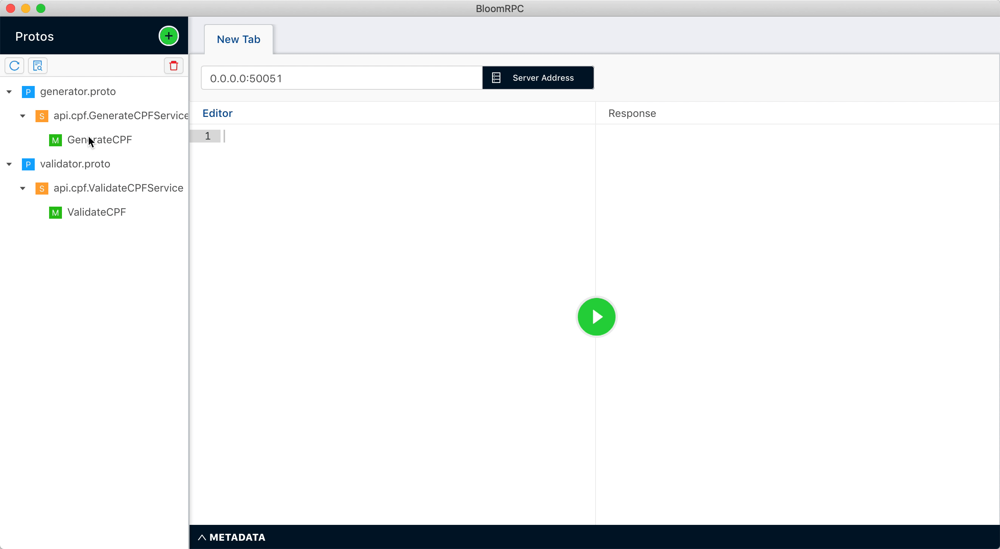

# :brazil: Brazilian Utils gRPC Service

This project exposes Brazilian Utils as a gPRC Service using Go.

## Features

This is the roadmap for the first release

- [x] CPF Generation
- [x] CPF Validation
- [ ] CNPJ Generation
- [ ] CNPJ Validation
- [ ] Tests

## Preview

In this preview I'm using the awesome [BloomRPC](https://github.com/uw-labs/bloomrpc) as a GUI client to connect to the gRPC service.

## License

[MIT](LICENSE)
